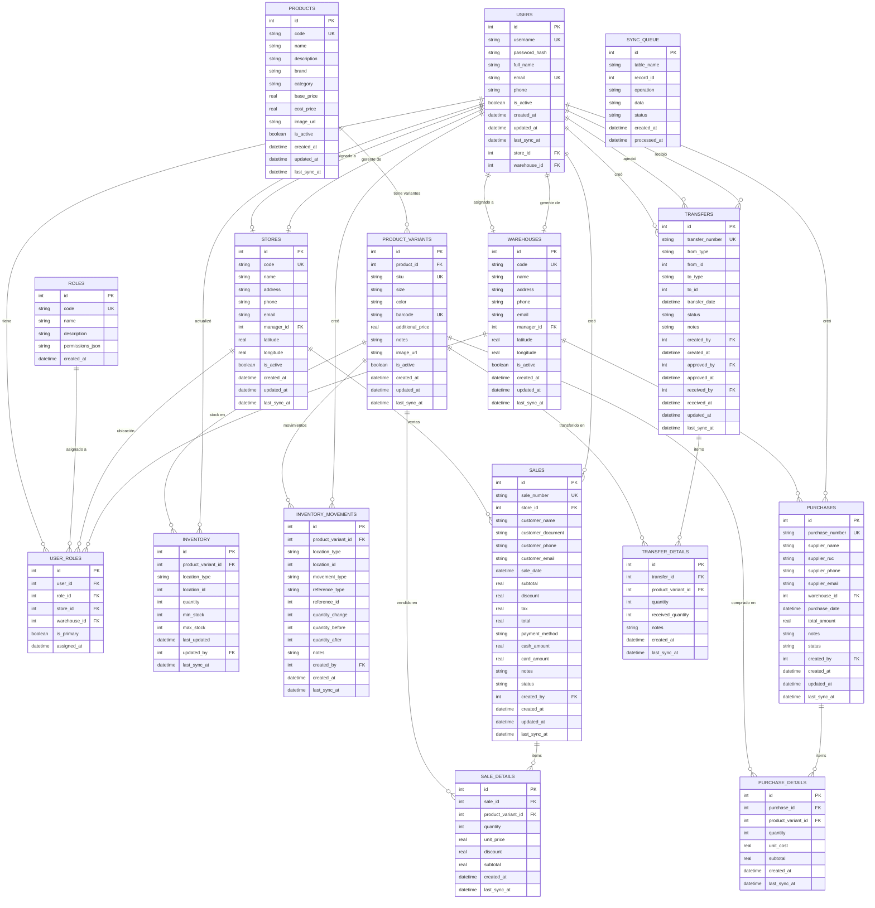

# Diagrama de Base de Datos - Inventory App

## Diagrama Mermaid (para GitHub/GitLab/Notion)

Copia y pega en cualquier editor que soporte Mermaid o en [mermaid.live](https://mermaid.live)

---

## Uso del Diagrama

### Opción 1: Mermaid Live Editor
1. Ve a [mermaid.live](https://mermaid.live)
2. Copia el código Mermaid de arriba
3. Descarga como PNG, SVG o PDF

### Opción 2: dbdiagram.io
1. Ve a [dbdiagram.io](https://dbdiagram.io)
2. Usa el archivo DBML incluido abajo
3. Exporta como PNG, PDF o SQL

### Opción 3: Draw.io / diagrams.net
1. Ve a [diagrams.net](https://app.diagrams.net)
2. Importa el diagrama o créalo manualmente
3. Exporta en cualquier formato

---

## Resumen de Tablas

| Tabla | Descripción | Registros relacionados |
|-------|-------------|------------------------|
| `users` | Usuarios del sistema | Roles, Tiendas, Almacenes |
| `roles` | Roles y permisos | Usuarios |
| `user_roles` | Asignación usuario-rol | Usuarios, Roles, Ubicaciones |
| `stores` | Tiendas/Sucursales | Ventas, Inventario, Usuarios |
| `warehouses` | Almacenes | Compras, Inventario, Usuarios |
| `products` | Productos base | Variantes |
| `product_variants` | Variantes (talla/color) | Inventario, Ventas, Compras |
| `inventory` | Stock por ubicación | Variantes, Ubicaciones |
| `inventory_movements` | Historial de movimientos | Variantes, Usuarios |
| `sales` | Cabecera de ventas | Tiendas, Usuarios |
| `sale_details` | Detalle de ventas | Ventas, Variantes |
| `purchases` | Cabecera de compras | Almacenes, Usuarios |
| `purchase_details` | Detalle de compras | Compras, Variantes |
| `transfers` | Cabecera transferencias | Usuarios (3), Ubicaciones |
| `transfer_details` | Detalle transferencias | Transferencias, Variantes |
| `sync_queue` | Cola sincronización offline | - |
